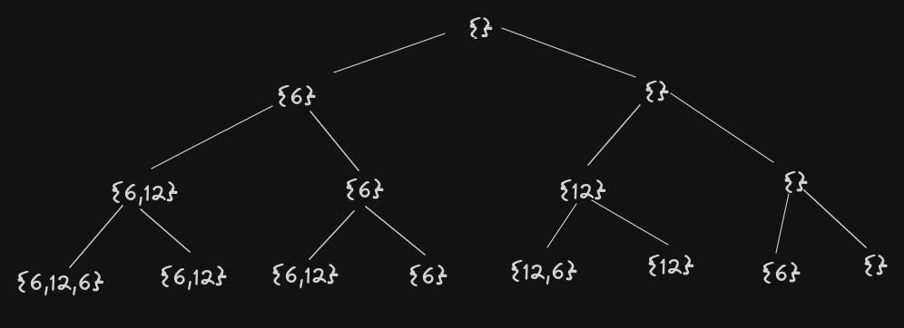
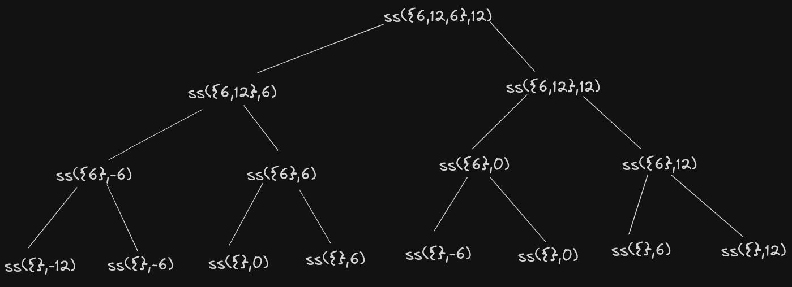

<font face="LaTeX">

### *SumaSubconjuntosBT*

1. *En este ejercicio vamos a resolver el problema de suma de subconjuntos con la técnica de backtracking. Dado un multiconjunto C = {$c_1$ , . . . , $c_n$ } de números naturales y un natural k, queremos determinar si existe un subconjunto de C cuya sumatoria sea k. Vamos a suponer fuertemente que C está ordenado de alguna forma arbitraria pero conocida (i.e., C está implementado como
la secuencia $c_1$ , . . . , $c_n$ o, análogamente, tenemos un iterador de C). Las soluciones (candidatas) son los vectores a = ($a_1$ , . . . , $a_n$ ) de valores binarios; el subconjunto P de C representado por a contiene a $c_i$ si y sólo si $a_i$ = 1. Luego, a es una solución válida cuando $\sum_{i=1}^{n} a_i c_i = k$. Asimismo,
una solución parcial es un vector p = (a1 , . . . , ai ) de números binarios con 0 ≤ i ≤ n. Si i < n,
las soluciones sucesoras de p son p ⊕ 0 y p ⊕ 1, donde ⊕ indica la concatenación.*
    
    ---
    *a) Escribir el conjunto de soluciones <strong>candidatas</strong> para C = {6, 12, 6} y k = 12.*

    ```python
    {0,0,0} {0,0,1} {0,1,0} {0,1,1} {1,0,0} {1,0,1} {1,1,0} {1,1,1}
    ```
    ---

    *b) Escribir el conjunto de soluciones <strong>válidas</strong> para C = {6, 12, 6} y k = 12.*
    
    ---

    ```python
    {0,1,0} {1,0,1}
    ```
    *c) Escribir el conjunto de soluciones <strong>parciales</strong> para C = {6, 12, 6} y k = 12.*

    ```python
    {0,0,0} {1,0,0} {0,1,0} {0,0,1}
    ```

    ---

    *d) Dibujar el árbol de backtracking correspondiente al algoritmo descrito arriba para C = {6, 12, 6} y k = 12, indicando claramente la relación entre las distintas componentes del árbol y los conjuntos de los incisos anteriores.*

    

    ---

    *e) Sea C la familia de todos los multiconjuntos de números naturales. Considerar la siguiente función recursiva $ss : C × N → {V, F }$ (donde N = {0, 1, 2, . . . }, V indica verdadero y F falso):*

    
    $$ ss(\{c_1,...,c_n\}, k) =  \begin{cases} k==0 & \text{si } n = 0 \\ ss(\{c_1, . . . , c_{n−1}\}, k) ∨ ss(\{c_1 , . . . , c_{n−1} \}, k − c_n ) & \text{si } n > 0 \end{cases}$$

    *ss(C, k) = V si y sólo si el problema de subconjuntos tiene una solución válida para la entrada C, k. Observar que hay <strong>dos posibilidades</strong> para una solución válida $a = (a_1 , . . . , a_n )$ para el caso $n > 0$: o bien $a_n = 0$ o bien $a_n = 1$. En el primer caso, existe un subconjunto de $\{c_1 , . . . , c_{n−1} \}$ que suma k; en el segundo, existe un subconjunto de $\{c_1 , . . . , c_{n−1} \}$ que suma k − $c_n$ .*

    ---

    *f) Implementación recursiva de ss en un lenguaje imperativo que retorna la solución para C, k cuando se llama con C, |C|, k. ¿Cuál es su complejidad?*

    implementa $ss(\{c_1 , . . . , c_i \}, j)$
    ```py
    subset_sum(C, i, j): 
    
    Si i = 0 
        retornar (j == 0)
    
    Si no 
        retornar subset_sum(C, i−1, j) v subset_sum(C, i−1, j − C[i])
    ```

    *La complejidad de la implementación es $O(2^n)$.*

    ---

    *g) Dibujar el árbol de llamadas recursivas para la entrada C = {6, 12, 6} y k = 12, y compararlo con el árbol de backtracking.*

    

    ---

    *h) Considerar la siguiente regla de factibilidad : $p = (a_1 , . . . , a_i )$ se puede extender a una solución válida sólo si $\sum_{q=1}^{i} a_q c_q \leq  k$.*
    
    *La siguiente implementación incluye la regla de factibilidad.*

    ```py
    subset_sum(C, i, j): 
    Si j < 0 
        retornar falso // regla de factibilidad
    
    Si i = 0 
        retornar (j = 0)
    
    Si no 
        retornar subset_sum(C, i − 1, j) ∨ subset_sum(C, i − 1, j − C[i])
    ```

    ---

    *i) Definir otra regla de factibilidad, mostrando que la misma es correcta; no es necesario implementarla.*

    ```py
    subset_sum(C, i, j):
    si j < suma_de_todos_los_elementos_de_C
        retornar falso // regla de factibilidad
    ...
    ```

    ---

    *j) Modificar la implementación para imprimir el subconjunto de C que suma k, si existe. Ayuda: mantenga un vector con la solución parcial p al que se le agregan y sacan los elementos en cada llamada recursiva; tenga en cuenta de no suponer que este vector se copia en cada llamada recursiva, porque cambia la complejidad.*

    ```py
    subset_sum(C, i, j, p):
    Si j < 0 
        retornar falso // regla de factibilidad
    Si i = 0
        Si j = 0
            imprimir p
        retornar (j = 0)
    Si no
        retornar subset_sum(C, i − 1, j, p) ∨ subset_sum(C, i − 1, j − C[i], p + [C[i]])
    ```

</font>