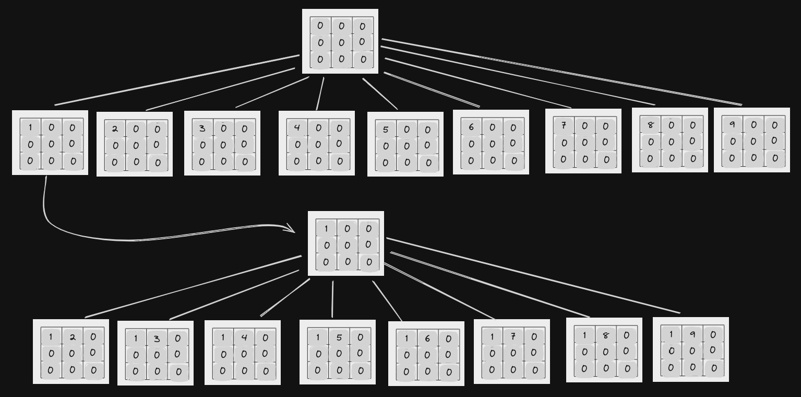

<font face="LaTeX">

### <u>*MagiCuadrados*</u>

*Un cuadrado mágico de orden n, es un cuadrado con los números {1, . . . , $n^2$ }, tal que todas sus filas, columnas y las dos diagonales suman lo mismo. El número que suma cada fila es llamado número mágico.*

*El objetivo de este ejercicio es contar cuántos cuadrados mágicos de orden n existen.*

---

*a) ¿Cuántos cuadrados habría que generar para encontrar todos los cuadrados mágicos si se
utiliza una solución de fuerza bruta?*

<strong>*Con fuerza bruta tendríamos que generar todos los cuadrados posibles de $n^2$ números y luego verificar cuáles cumplen la propiedad de ser mágico. Por combinatoria deberíamos generar $n^2!$ cuadrados.*</strong>

---

*b) Enunciar un algoritmo que use <strong>backtracking</strong> para resolver este problema que se base en la
siguientes ideas:*
* *La solución parcial tiene los valores de las primeras `i−1` filas establecidos, al igual que los valores de las primeras `j` columnas de la fila `i`.*
* *Para establecer el valor de la posición `(i, j+1)` (o `(i+1, 1)` si `j = n e i != n`) se consideran todos los valores que aún no se encuentran en el cuadrado.*

* *Para cada valor posible, se establece dicho valor en la posición y se cuentan todos los cuadrados mágicos con esta nueva solución parcial.*

*El algoritmo debe devolver la cantidad de cuadrados mágicos de orden `n`.*

```python
def magiCuadrados(n):
    def esMagico(cuadrado):
        m = sum(cuadrado[0])
        for i in range(n):
            if sum(cuadrado[i]) != m:
                return False
            if sum(cuadrado[j][i] for j in range(n)) != m:
                return False
        if sum(cuadrado[i][i] for i in range(n)) != m:
            return False
        if sum(cuadrado[i][n-i-1] for i in range(n)) != m:
            return False
        return True

    def backtracking(cuadrado, i, j):
        if i == n:
            if esMagico(cuadrado):
                return 1
            return 0
        if j == n:
            return backtracking(cuadrado, i+1, 0)
        count = 0
        for k in range(1, n**2+1):
            if k not in cuadrado[i] and k not in [cuadrado[l][j] for l in range(i)]:
                cuadrado[i][j] = k
                count += backtracking(cuadrado, i, j+1)
                cuadrado[i][j] = 0
        return count

    return backtracking([[0]*n for _ in range(n)], 0, 0)
```

---

*Mostrar los primeros dos niveles del árbol de backtracking para `n = 3`.*




---

*c) Demostrar que el árbol de backtracking tiene $O(n^2)!$ nodos en peor caso.*

*El árbol de backtracking tiene $n^2$ niveles, en cada nivel se generan $n^2 - n$ nodos, ya que en cada nivel se generan $n^2$ posibles valores y se descartan $n$ valores que ya se encuentran en la fila o columna.*

*Por lo tanto, el árbol de backtracking tiene $O(n^2)!$ nodos en peor caso.*

---

*d ) Considere la siguiente poda al árbol de backtracking: al momento de elegir el valor de una nueva posición,*
* *Verificar que la suma parcial de la fila no supere el número mágico.* 
* *Verificar también que la suma parcial de los valores de las columnas no supere el número mágico.*

*Introducir estas podas al algoritmo e implementarlo en la computadora. ¿Puede mejorar
estas podas?*

```python
def magiCuadrados(n):
    def esMagico(cuadrado):
        m = sum(cuadrado[0])
        for i in range(n):
            if sum(cuadrado[i]) != m:
                return False
            if sum(cuadrado[j][i] for j in range(n)) != m:
                return False
        if sum(cuadrado[i][i] for i in range(n)) != m:
            return False
        if sum(cuadrado[i][n-i-1] for i in range(n)) != m:
            return False
        return True

    def backtracking(cuadrado, i, j):
        if i == n:
            if esMagico(cuadrado):
                return 1
            return 0
        if j == n:
            return backtracking(cuadrado, i+1, 0)
        count = 0
        for k in range(1, n**2+1):
            if k not in cuadrado[i] and k not in [cuadrado[l][j] for l in range(i)]:
                if i > 0: m = sum(cuadrado[0][j])
                else: m = float('inf')
                if sum(cuadrado[i][:j] + [k]) <= m and sum(cuadrado[l][j] for l in range(i)) <= m:
                    cuadrado[i][j] = k
                    count += backtracking(cuadrado, i, j+1)
                    cuadrado[i][j] = 0
        return count

    return backtracking([[0]*n for _ in range(n)], 0, 0)
```

*e) Demostrar que el número mágico de un cuadrado mágico de orden n es siempre ($n^3 +
n) \div 2$. Adaptar la poda del algoritmo del ítem anterior para que tenga en cuenta esta nueva
información. Modificar la implementación y comparar los tiempos obtenidos para calcular
la cantidad de cuadrados mágicos.*

</font>